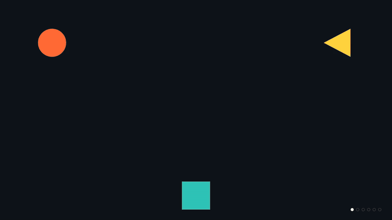
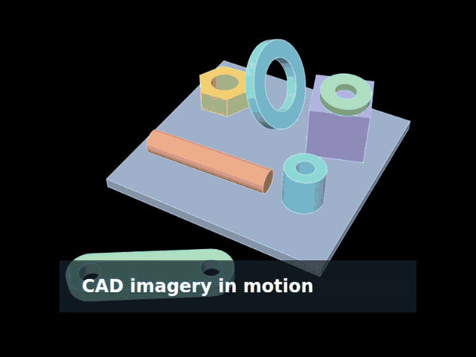

# kavad

kavad turns an [fsm](https://github.com/lestrrat-go/fsm) state machine into an
animated show: a promo video, a signage loop, a kiosk attract screen. The name
comes from the kaavad of Rajasthan, a wooden box whose painted panels a
storyteller opens one after another.

The machine is the storyboard. Each scene is a state, and the machine sets the
order and the timing by asking its host to schedule events
(`host.Schedule("next", 5000)`). Go code draws each moment on a small canvas
(polygons, polylines, circles, text and preloaded PNGs). The machine never sees a clock: the
program that plays the show advances time and delivers the scheduled events,
so the same show plays the same way in every runner.

## Gallery

The [promo show](examples/promo) animates shapes into the fsm logo.



The [image asset show](examples/imageassets) moves and fades an embedded PNG
beneath a caption.



## Runners

| Package | Plays the show | Clock |
|---|---|---|
| `desktop` | in a native window (Ebitengine) | Ebitengine's 60 Hz update tick |
| `web` | in a web page, as WebAssembly on a `<canvas>` | the browser's `requestAnimationFrame` |
| `svg` | as one SVG document per frame | a virtual clock, for tests and video capture |

`desktop` and `web` loop the show, holding the last moment for one second
before restarting.

## Writing a show

A show has four parts. [`examples/promo`](examples/promo) has all of them.

1. **The storyboard machine.** Write it as an fsm machine file: a Go file
   whose `Definition` returns the machine, with typed Go functions as entry
   actions. A scene state's entry action calls `host.Scene(id)`, does the
   scene's own work, and calls `host.Schedule("next", ms)`; the state moves to
   the next scene on `"next"`. `fsm import -host` writes a first version of
   the file from a JSON document. Run `fsm check` on the file after each edit.
2. **The host interface.** Embed `kavad.Host` (which has `Scene` and
   `Schedule`) and add the calls your actions make.
3. **The host.** Embed `*kavad.Stage` to get `Scene` and `Schedule`, implement
   the rest, and implement `kavad.Painter`. `Paint(c, now)` draws the moment
   `now` (ms). The `draw` package has a pen that fades and shifts what it
   draws, plus outline helpers. The `ease` package has easing curves.
4. **A `kavad.Show` value.** `Size` returns the canvas size. `Start` compiles
   the machine against a fresh host and returns
   `kavad.NewRun(instance, host.Stage, host)`.

Each runner then needs a one-line command:

```go
func main() { desktop.Main(promo.Show{}) } // cmd/play
func main() { web.Main(promo.Show{}) }     // cmd/web
func main() { svg.Main(promo.Show{}) }     // cmd/render
```

## Running the promo

From the repository root:

```sh
go run github.com/lestrrat-go/fsm/cmd/fsm check examples/promo/promofsm/promo.go
go run ./examples/promo/cmd/play                # native window; F toggles fullscreen, Esc quits
go run ./examples/promo/cmd/web -out out/web    # files for a web page
go run ./examples/promo/cmd/render -out out     # out/frames.html
node capture/capture.cjs out                    # out/video.mp4 and out/video.gif
```

`capture.cjs` needs the `playwright` package (with Chromium) and `ffmpeg`.
The GIF is 800 px wide at 20 fps, for places such as a GitHub README that show
images but not video or scripts.

## Embedding in a web page

`go run ./examples/promo/cmd/web -out out/web` writes `show.wasm` (about 4 MB,
1.1 MB gzipped), `wasm_exec.js`, `kavad.js` and `index.html`. Serve that
directory, then add one tag where the show should appear:

```html
<script src="web/kavad.js"></script>
```

`kavad.js` loads the other files from its own directory and draws into
`<canvas id="kavad">`, adding the canvas after the script tag when the page
has none. The canvas fills the width of its container at the show's aspect
ratio. To use an `<iframe>` instead, point it at `index.html`. A page can hold
one show.

## Image assets

Load a PNG in `Show.Start` with `kavad.LoadPNG(fsys, name)` and pass the image
to `kavad.NewRun` after the painter. The show chooses the filesystem and path;
an `embed.FS` puts the same bytes in native and WASM builds. Draw it with
`Canvas.DrawImage` or `draw.Pen.Image`. Both fit it within the target rectangle
without stretching it and apply opacity to the PNG's alpha. The canvas draws
each call in order, so later shapes and text appear above the image.

The web runner decodes registered images before its first frame and clears the
canvas to transparency before each frame. With an `embed.FS`, the WASM bundle
contains the image bytes and needs no separate image URL. The SVG runner writes
each PNG once under `assets/` beside `frames.html`; keep that directory beside the page
when moving it or running `capture/capture.cjs`.

[`examples/imageassets`](examples/imageassets) embeds the lestrrat-3d site's
`hero.png` and moves and fades it beneath a caption. From the repository root:

```sh
go run ./examples/imageassets/cmd/web -out out/image-web
go run ./examples/imageassets/cmd/render -out out/image-frames -fps 2 -seconds 1
node capture/capture.cjs out/image-frames
go run ./examples/imageassets/cmd/play -shots 100,1000 -out out/image-frames
```

## Status

fsm has no tagged release yet. `go.mod` requires a pseudo-version of a commit
on fsm's `main` branch.

## License

This project is **source-available**, and is licensed under the
[PolyForm Noncommercial License 1.0.0](LICENSE).

* **Noncommercial use is free.** Individuals, hobby and personal projects,
  research, education, nonprofits, and government may use, modify, and
  redistribute it at no cost, subject to the license terms.
* **Commercial / business use requires a separate license.** Any use by or for
  a business, or for commercial advantage, is not permitted under the
  noncommercial license. To obtain a commercial license, reach out on Bluesky
  at [@lestrrat.bsky.social](https://bsky.app/profile/lestrrat.bsky.social).

### Contributions

This repository does **not** accept external pull requests.
